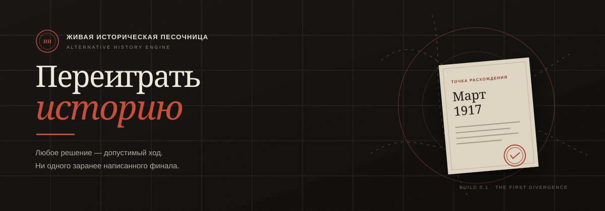
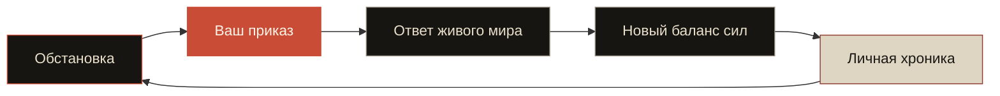
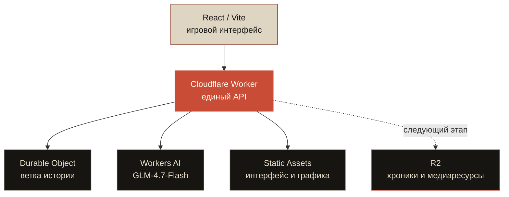

<p align="center">
  
</p>

<p align="center">
  
  
  
  
</p>

<p align="center">
  <strong>История уже случилась. Но не здесь.</strong><br />
  Игрок управляет государством, а мир отвечает на любое его решение —<br />
  интересами людей, дефицитом ресурсов и непредвиденными союзами.
</p>

---

## ◼ Проблема

> Стратегии обещают «переписать историю», но на деле водят игрока по рельсам заранее прописанных сценариев — и со второго прохождения становятся предсказуемыми.

## ◇ Гипотеза

> ИИ становится не рассказчиком поверх готового сюжета, а **живым движком причин и последствий**. Игрок формулирует любое государственное решение и получает уникальный, нигде не записанный ход истории.

Игрок свободен в замысле, но не всемогущ в исполнении. ИИ учитывает ресурсы, институты, логистику, интересы фракций и ограниченность власти — и **не обязан делать хороший план успешным**.

---

## 01 · Первая точка разлома

| | |
|---|---|
| **Сценарий** | Россия после отречения |
| **Дата старта** | Март 1917 года |
| **Роль** | Глава Временного правительства |
| **Цель** | Удержать государство от распада и создать новый легитимный порядок |
| **Сложность** | Безжалостно |

Николай II отрёкся. В Петрограде одновременно существуют Временное правительство и Совет. Фронт рассыпается, деревня ждёт землю, союзники требуют продолжать войну. У государства нет ни конституции, ни надёжной армии — только несколько недель доверия.

## 02 · Игровой цикл



- свободный приказ или одна из трёх динамических подсказок;
- пять контуров государства: легитимность, экономика, армия, порядок и дипломатия;
- реакции Советов, Ставки, провинции и иностранных держав;
- неожиданные, но причинно связанные события;
- новая тройка решений после каждого хода;
- персональная хроника альтернативной ветки.

### Три масштаба одной истории

| Режим | Ритм | Обещание |
|---|---|---|
| **Хроника** | 8–12 ходов | один кризис и плотный эпилог |
| **Кампания** | 25–40 ходов | четыре акта и последствия, возвращающиеся спустя месяцы |
| **Песочница** | без лимита | свободная цель, смена кабинетов и продолжающийся мир |

ИИ получает не только показатели страны, но и библию мира: характеры, страхи, частичное знание, отношения, предметы, транспорт, фоновые существа и условные микросцены. Поэтому один и тот же приказ может стать разговором со Ставкой, утечкой журналистке или задержанным на станции эшелоном.

→ [Сценарии, персонажи и контракт ИИ-режиссёра](docs/narrative-design.md)

→ [Каталог коротких историй и отдельных миров](docs/story-catalog.md)

## 03 · Мир должен быть виден

Визуальный слой строится как **живой театр бумажной истории**, а не как декоративная панель вокруг текста:

| Слой | Как он оживает |
|---|---|
| **Персонажи** | Прозрачные PNG/WebP: министры, военные, дипломаты и представители фракций. Появление, дыхание, поворот, параллакс. |
| **Сцены** | Кабинет, улица, фронт, вокзал и типография собираются из нескольких движущихся планов. |
| **Предметы** | Указы, печати, карты, газеты, телеграммы, вагоны и хлебные карточки становятся игровыми сигналами. |
| **Последствия** | Свет, толпы, пустые полки, разорванные карты и движение фронта меняются вместе с состоянием страны. |
| **Титры** | Названия глав, печати и газетные шапки стилизованы; основной текст остаётся настоящим и читаемым. |

Палитра проекта: архивная бумага, угольный чёрный, кирпично‑красный и приглушённое золото. Визуальный язык соединяет политический плакат, газетную печать и театральную декорацию.

→ [Визуальная библия и реестр игровых ассетов](docs/visual-bible.md)

---

## 04 · Архитектура



Workers AI моделирует основной ход. Если модель временно недоступна или исчерпан дневной лимит, встроенный причинный симулятор не даёт прохождению сломаться. Состояние каждой ветки изолировано в SQLite-backed Durable Object.

## 05 · Что уже работает

- [x] выбор стартовой точки разлома;
- [x] первый играбельный сценарий;
- [x] свободный ввод государственных решений;
- [x] AI-ответ с эффектами, реакциями и следующими вариантами;
- [x] причинный локальный fallback;
- [x] живая хроника прохождения;
- [x] Cloudflare Workers AI и Durable Objects bindings;
- [x] адаптивный интерфейс;
- [x] production-сборка и автоматические тесты;
- [x] первый пакет персонажей и сцен: министр, офицер, журналистка-автокурьер и штабной автомобиль;
- [x] три режима: хроника, кампания и открытая песочница;
- [x] библия мира из 12 озвучиваемых персонажей и системных микросцен;
- [ ] анимированная карта причинных цепочек;
- [ ] второй сценарий — СССР, март 1985;
- [ ] экспорт прохождения как собственной альтернативной летописи.

## 06 · Локальный запуск

```bash
npm install
npm run build
npm run preview
```

Для разработки интерфейса с горячей перезагрузкой:

```bash
# терминал 1
npm run dev:worker

# терминал 2
npm run dev
```

## 07 · Деплой

Проект готов к публикации как единый Cloudflare Worker:

```bash
npx wrangler login
npm run deploy
```

Bindings `AI`, `HISTORY_SESSIONS` и `ASSETS` уже описаны в `wrangler.jsonc`. Секреты, локальные переменные и Cloudflare-ключи исключены из Git. Push в `main` запускает тесты, сборку и автоматический деплой через GitHub Actions.

---

<p align="center">
  <sub>Каждая партия создаёт историю, которой до этого не существовало.</sub><br />
  <strong>BUILD 0.1 · THE FIRST DIVERGENCE</strong>
</p>
