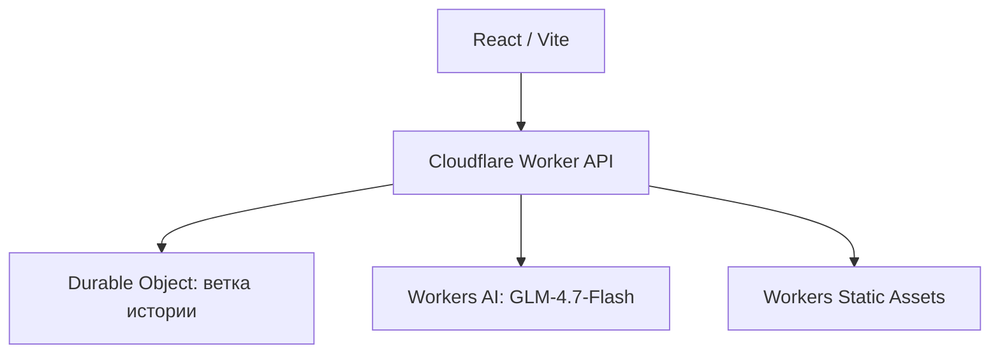

# Переиграть историю: живая ИИ‑песочница

Игровой прототип, в котором игрок управляет государством, формулирует любое решение, а ИИ моделирует правдоподобные политические, экономические и социальные последствия. Ветка истории хранится отдельно для каждого прохождения и не сводится к заранее прописанным концовкам.

## Что уже работает

- выбор стартового исторического разлома;
- первый играбельный сценарий: Россия после отречения, март 1917;
- свободный ввод решения или выбор одной из динамических подсказок;
- последствия по пяти контурам государства и реакции центров силы;
- непредвиденные события и новая тройка решений на каждом ходу;
- живая хроника прохождения;
- сохранение сессии в Cloudflare Durable Object;
- генерация через Cloudflare Workers AI с причинным локальным fallback.

## Архитектура



Worker использует модель `@cf/zai-org/glm-4.7-flash`, доступную на Workers Free. Если модель недоступна или исчерпан дневной лимит, ход не ломается: срабатывает встроенный причинный симулятор.

## Локальный запуск

```bash
npm install
npm run build
npm run preview
```

Для разработки интерфейса с HMR запустите в двух терминалах:

```bash
npm run dev:worker
npm run dev
```

## Деплой в Cloudflare

```bash
npx wrangler login
npm run deploy
```

Нужные bindings (`AI`, `HISTORY_SESSIONS`, `ASSETS`) уже описаны в `wrangler.jsonc`. API‑токены, R2‑ключи и локальные `.dev.vars` исключены из Git.

## Ближайшие этапы

1. Балансировка причинной модели и проверка историками.
2. Разветвлённая карта мира и видимые цепочки причин.
3. Второй сценарий — СССР, март 1985.
4. R2 для экспортируемых хроник и пользовательских сценариев.
5. Режим «почему это произошло» с объяснением факторов без раскрытия скрытых рассуждений модели.
